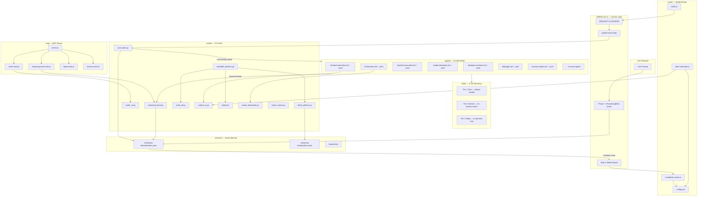

# Agenticana v2 — Architecture

> **Version:** 2.0.0 | **Updated:** 2026-03-01
> Complete system map for agents, skills, memory, router, and MCP server.

---

## System Overview



---

## Component Reference

### 1. Router (`router/`)

| File | Purpose |
|------|---------|
| `complexity-scorer.js` | Scores task 1-10 from keywords + domain count + length |
| `token-estimator.js` | Pre-flight token count for agent + skills + prompt |
| `router.js` | Main engine → outputs `{ model, tier, strategy, skills }` |
| `config.json` | Model names, thresholds, keyword lists |

**Model Tiers:**

| Score | Tier | Model | Use Case |
|-------|------|-------|----------|
| 1-2 | `lite` | gemini-2.0-flash-lite | Trivial edits, typos |
| 3-4 | `flash` | gemini-2.0-flash | Simple single-domain |
| 5-7 | `pro` | gemini-2.5-pro | Moderate multi-domain |
| 8-10 | `pro-extended` | gemini-2.5-pro | Complex architectural |

**Context Strategies:**

| Strategy | Max Skills | Load Tier | Compress |
|----------|-----------|-----------|---------|
| `FULL` | 5 | 3 | No |
| `COMPRESSED` | 2 | 2 | Yes |
| `MINIMAL` | 1 | 1 | Yes |

---

### 2. Memory (`memory/`)

| File | Purpose |
|------|---------|
| `reasoning-bank/decisions.json` | Stores all past agent decisions (10 pre-seeded) |
| `reasoning-bank/patterns.json` | Distilled recurring patterns (3 pre-seeded) |
| `trajectories/` | Full agent run records (input→steps→output→tokens) |
| `schemas/memory-schema.json` | JSON Schema for validation |

**Decision Schema:**
```json
{
  "id": "rb-001",
  "task": "Build JWT auth system",
  "agent": "backend-specialist",
  "decision": "bcrypt cost=12 + httpOnly cookies + 15min access token",
  "outcome": "Deployed, 0 security issues found",
  "success": true,
  "tokens_used": 4200,
  "embedding": [0.12, 0.34, ...],
  "tags": ["auth", "jwt", "backend"]
}
```

---

### 3. Agent YAML Specs (`agents/*.yaml`)

Every `.md` file now has a companion `.yaml` with:

```yaml
name: frontend-specialist
version: "2.0.0"
model_tier: pro          # default model tier
complexity_tier: MODERATE
token_budget:
  context_max: 60000
  output_max: 6000
  skill_slots: 3
capabilities: [...]
boundaries:
  can: [...]
  cannot: [...]
learning:
  enabled: true
  pattern_threshold: 0.80
routing_hints:
  trigger_keywords: [react, component, ui, css]
  auto_invoke: true
```

---

### 4. Skill Tiers (`skills/`)

**Tier 1 — Core (always loaded):**
`clean-code`, `brainstorming`, `plan-writing`, `intelligent-routing`, `behavioral-modes`, `parallel-agents`

**Tier 2 — Domain (loaded on domain match):**
`frontend-design`, `mobile-design`, `api-patterns`, `database-design`, `testing-patterns`,
`nextjs-react-expert`, `nodejs-best-practices`, `architecture`, `game-development`, `systematic-debugging`

**Tier 3 — Utility (loaded on explicit need only):**
`seo-fundamentals`, `i18n-localization`, `web-design-guidelines`, `tailwind-patterns`,
`geo-fundamentals`, `lint-and-validate`, `vulnerability-scanner`, `performance-profiling`,
`webapp-testing`, `documentation-templates`, `deployment-procedures`, `server-management`,
`tdd-workflow`, `code-review-checklist`, `python-patterns`, `red-team-tactics`,
`mcp-builder`, `app-builder`, `bash-linux`, `powershell-windows`

---

### 5. MCP Server (`mcp/`)

**Start:** `cd mcp && npm install && node server.js`

**11 Tools Exposed:**

| Category | Tool | Description |
|----------|------|-------------|
| ReasoningBank | `reasoningbank_retrieve` | Find similar past decisions |
| ReasoningBank | `reasoningbank_record` | Store new decision |
| ReasoningBank | `reasoningbank_distill` | Extract patterns |
| Router | `router_route` | Get model/strategy recommendation |
| Router | `router_stats` | View config and savings |
| Memory | `memory_store` | Save key-value to agent memory |
| Memory | `memory_search` | Semantic memory search |
| Memory | `memory_consolidate` | Compress and deduplicate |
| Agents | `agent_list` | List all agents with metadata |
| Agents | `agent_get` | Get full agent YAML spec |
| Agents | `skill_list` | List skills by tier |

**Claude Desktop integration:**
```json
{
  "mcpServers": {
    "Agenticana": {
      "command": "node",
      "args": ["d:/_Projects/AGENTICANA/mcp/server.js"]
    }
  }
}
```

---

### 6. Scripts (`scripts/`)

| Script | Command | Purpose |
|--------|---------|---------|
| `reasoning_bank.py` | `python scripts/reasoning_bank.py retrieve "task"` | Query ReasoningBank |
| `reasoning_bank.py` | `python scripts/reasoning_bank.py record --task X --decision Y --outcome Z --success true` | Record decision |
| `reasoning_bank.py` | `python scripts/reasoning_bank.py stats` | Show stats |
| `router_cli.py` | `python scripts/router_cli.py "task"` | Get model recommendation |
| `router_cli.py` | `python scripts/router_cli.py --stats` | Show config |
| `distill_patterns.py` | `python scripts/distill_patterns.py` | Extract patterns |
| `verify_all.py` | `python scripts/verify_all.py .` | Full project audit |
| `heartbeat_daemon.py` | `python scripts/heartbeat_daemon.py` | Background maintenance |
| `soul_inject.py` | `python scripts/soul_inject.py "task"` | Retrieve RAG-Enhanced Soul Memory |
| `capture_ui.py` | `python scripts/capture_ui.py "url"` | Visual verification |
| `notify.ps1` | `powershell -File scripts/notify.ps1` | Audio/Visual Alert |
| `swarm_dispatcher.py` | `python scripts/swarm_dispatcher.py manifest.json --shadow` | Parallel & Isolated agent execution |
| `sandbox_manager.py` | `python scripts/sandbox_manager.py` | Environment isolation & merge |
| `swarm_status.py` | `python scripts/swarm_status.py` | Real-time swarm monitoring |
| `sentinel.py` | `python scripts/sentinel.py` | Autonomous error repair |
| `vector_memory.py` | `python scripts/vector_memory.py` | Lightweight semantic store |
| `dashboard_api.py` | `python scripts/dashboard_api.py` | Control Center Backend |
| `agent_cli.py` | `python scripts/agent_cli.py @agent "task"` | CLI entry for agents |

---

## Agent Roster (20 agents)

| Agent | Model Tier | Complexity | Domain | Auto-Invoke |
|-------|-----------|------------|--------|-------------|
| `orchestrator` | pro | COMPLEX | orchestration | ⚠️ ask first |
| `project-planner` | pro | COMPLEX | planning | ⚠️ ask first |
| `frontend-specialist` | pro | MODERATE | frontend | ✅ |
| `backend-specialist` | pro | MODERATE | backend | ✅ |
| `mobile-developer` | pro | COMPLEX | mobile | ✅ |
| `database-architect` | flash | MODERATE | database | ✅ |
| `debugger` | pro | MODERATE | debugging | ✅ |
| `security-auditor` | pro | MODERATE | security | ✅ |
| `penetration-tester` | pro | COMPLEX | security | ⚠️ ask first |
| `devops-engineer` | flash | MODERATE | devops | ✅ |
| `test-engineer` | flash | SIMPLE | testing | ✅ |
| `qa-automation-engineer` | flash | MODERATE | testing | ✅ |
| `explorer-agent` | flash | SIMPLE | discovery | ✅ |
| `code-archaeologist` | flash | SIMPLE | discovery | ✅ |
| `documentation-writer` | flash | SIMPLE | documentation | ❌ explicit only |
| `performance-optimizer` | pro | MODERATE | performance | ✅ |
| `game-developer` | pro | COMPLEX | game | ✅ |
| `seo-specialist` | flash | SIMPLE | seo | ✅ |
| `product-manager` | flash | MODERATE | planning | ❌ explicit only |
| `product-owner` | flash | SIMPLE | planning | ❌ explicit only |

---

## Token Savings Breakdown

| Technique | Estimated Savings | Status |
|-----------|------------------|--------|
| Model Router (flash for simple) | ~40% on simple tasks | ✅ Active |
| Tier-1 only for SIMPLE tasks | ~25% context reduction | ✅ Active |
| ReasoningBank fast-path | ~60% when similarity > 0.85 | ✅ Active |
| Skill filtering (COMPRESSED) | ~30% when near budget | ✅ Active |
| **Overall estimated savings** | **≥ 30% average** | |

---

## v2 Data Flow (Full Request Lifecycle)

```
User Request
    │
    ▼
Phase -1: ReasoningBank Query
    → python scripts/reasoning_bank.py retrieve "{task}" --k 3
    → If similarity > 0.85: offer fast-path (skip planning)
    │
    ▼
Step 0: Model Router
    → python scripts/router_cli.py "{task}" --agent {agent}
    → Returns: { model: "flash", strategy: "COMPRESSED", skills: ["clean-code"] }
    │
    ▼
REQUEST CLASSIFIER
    → Load Tier-1 skills always
    → Load Tier-2 skills if domain matches
    → Load Tier-3 skills ONLY if explicitly needed
    │
    ▼
AGENT ROUTING → Specialist Agent Invocation
    │
    ▼
Task Execution
    │
    ▼
Phase END: Record to ReasoningBank
    → python scripts/reasoning_bank.py record --task "..." --decision "..." --success true
    │
    ▼
Periodic: Distill Patterns
    → python scripts/distill_patterns.py
```

---

*Generated by Agenticana v2 — 2026-03-01*
