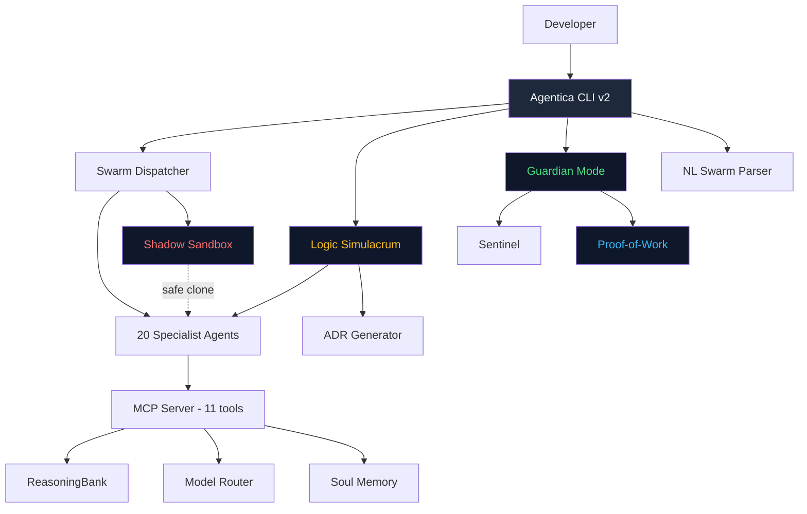

<div align="center">


# Agenticana v6.0 🦅

### The Sovereign AI Developer OS — Secretary Bird Edition

[](LICENSE)
[](https://python.org)
[](https://nodejs.org)
[](https://modelcontextprotocol.io)
[](https://code.visualstudio.com)
[](#-p16-guardian-mode)
[](https://github.com/ashrafmusa/AGENTICANA)

**20 specialist agents · Swarm Dispatcher · Logic Simulacrum · Guardian Mode · Proof-of-Work · Self-Sovereign**

[Quick Start](#-quick-start) · [What It Does](#-what-agenticana-does) · [Phases](#-phases-p1--p19) · [Agents](#-20-specialist-agents) · [vs Competitors](#-vs-competitors) · [CLI](#-cli-reference)

</div>

---

## What is Agenticana?

Agenticana is a **Sovereign AI Developer OS** — not a chat assistant, not a VS Code plugin, but a full orchestration framework that deploys, coordinates, audits, and self-governs multiple AI agents **directly inside your codebase**.

```
┌──────────────────────────────────────────────────────────┐
│                     YOUR PROJECT                          │
│                                                           │
│  ┌────────────────────────────────────────────────────┐   │
│  │             AGENTICANA v6.0 🦅                     │   │
│  │         (The Sovereign Developer OS)               │   │
│  │                                                    │   │
│  │  Swarm · Sentinel · Simulacrum · Guardian · NL     │   │
│  │  ADR Generator · Proof-of-Work · Soul Bridge       │   │
│  └──────────────────────┬─────────────────────────────┘   │
│                         │ orchestrates                     │
│  ┌──────────────────────▼─────────────────────────────┐   │
│  │       20 Specialist AI Agents (Gemini/Claude)      │   │
│  └────────────────────────────────────────────────────┘   │
└──────────────────────────────────────────────────────────┘
```

### The one-sentence pitch:
> *Other tools ask AI to write your code. Agenticana makes AI agents debate the architecture, audit the security, benchmark the performance — and only THEN writes the code, in a sandboxed clone, with automatic rollback if it fails.*

---

## ✨ What Agenticana Does

### 🧠 ReasoningBank — AI That Learns From Your Work
```bash
python scripts/reasoning_bank.py record \
  --task "Add Stripe webhooks" \
  --decision "Use raw body parser before JSON middleware" \
  --outcome "Webhook signature verified correctly" \
  --success true
# Next time: similarity 0.93 → Fast Path → 60% fewer tokens
```

### 🔀 Swarm Dispatcher — 20 Agents in Parallel
```bash
python scripts/agentica_cli.py swarm .Agentica/swarm_manifest.json
# → Runs backend-specialist + security-auditor + test-engineer simultaneously
```

### 🦅 Logic Simulacrum — AI Agents Debate Before Coding
```bash
python scripts/agentica_cli.py simulacrum "Should we use JWT or HttpOnly cookies?"
# → backend-specialist, security-auditor, frontend-specialist debate in real-time
# → Consensus reached → Winner logs the rationale
# → ADR document auto-generated
```

### 🛡️ Guardian Mode — Pre-Commit AI Gate
```bash
python scripts/guardian_mode.py install
# Every git commit is now intercepted:
#   [1] Sentinel audit     → warns on issues
#   [2] Python lint        → blocks on syntax errors
#   [3] Secret scan        → blocks on hardcoded secrets
```

### 📝 NL Swarm — Plain English to Swarm
```bash
python scripts/nl_swarm.py "Add authentication to Django, audit it, and write tests" --run
# → Auto-detects agents: security-auditor, backend-specialist, test-engineer
# → Generates manifest → Dispatches swarm
```

### ✅ Proof-of-Work Commits — Trusted Code
```bash
python scripts/pow_commit.py sign
# Trust Score: 85/100 (CERTIFIED)
#   Debate:      YES — session d1a3705f
#   Performance: OPTIMAL
#   Guardian:    PASSED
```

---

## 🚀 Quick Start

### Prerequisites
- [Node.js 20+](https://nodejs.org)
- [Python 3.11+](https://python.org)
- [VS Code](https://code.visualstudio.com) with [GitHub Copilot](https://github.com/features/copilot)
- Git

### Option A: Clone & Setup
```bash
git clone https://github.com/ashrafmusa/AGENTICANA.git
cd Agenticana

# Windows
powershell -ExecutionPolicy Bypass -File setup.ps1

# Install MCP dependencies
cd mcp && npm install && cd ..
```

### Option B: Install Guardian (any project)
```bash
# Copy Agenticana into your project, then:
python scripts/guardian_mode.py install
# Every commit is now Secretary Bird approved 🦅
```

### Activate MCP in VS Code
```json
// .vscode/mcp.json
{
  "servers": {
    "Agenticana": {
      "type": "stdio",
      "command": "node",
      "args": ["path/to/AGENTICANA/mcp/server.js"]
    }
  }
}
```

Then in Copilot Chat:
```
@backend-specialist build a REST API with auth
@security-auditor review this auth flow
@orchestrator plan the full payment system
```

---

## 📦 Phases P1 → P19

| Phase | Feature | Script |
|-------|---------|--------|
| P1 | ReasoningBank (vector memory) | `reasoning_bank.py` |
| P2 | Model Router (cost-aware) | `router_cli.py` |
| P3 | Research Node | `research_node.py` |
| P4 | Agent Exchange | `exchange/` |
| P5 | Swarm Dispatcher | `swarm_dispatcher.py` |
| P6 | Vector Soul Memory | `vector_memory.py` |
| P7 | Soul Injection API | `soul_inject.py` |
| P8 | Sentinel (self-healing) | `sentinel.py` |
| P9 | Soul Bridge (cross-project) | `soul_bridge.py` |
| P10 | Heartbeat Daemon | `heartbeat_daemon.py` |
| P11 | Shadow Sandbox | `sandbox_manager.py` |
| P12 | Logic Simulacrum | `simulacrum.py` |
| P13 | Performance Pulse | `performance_pulse.py` |
| P14 | Agentica CLI v2 | `agentica_cli.py` |
| **P15** | **Real LLM Simulacrum** 🦅 | `real_simulacrum.py` |
| **P16** | **Guardian Mode** 🦅 | `guardian_mode.py` |
| **P17** | **NL Swarm** 🦅 | `nl_swarm.py` |
| **P18** | **ADR Generator** 🦅 | `adr_generator.py` |
| **P19** | **Proof-of-Work Commits** 🦅 | `pow_commit.py` |

---

## 🤖 20 Specialist Agents

| Agent | Domain | Auto-Invoked When |
|-------|--------|-------------------|
| `orchestrator` | Multi-domain planning | Complex multi-file tasks |
| `frontend-specialist` | React, Next.js, CSS | UI/component work |
| `backend-specialist` | APIs, Node.js, databases | Server/API work |
| `mobile-developer` | React Native, Capacitor | Mobile features |
| `database-architect` | Prisma, SQL, Firestore | Schema/query work |
| `debugger` | Root cause analysis | Any bug/error |
| `security-auditor` | OWASP, auth, rules | Security reviews |
| `devops-engineer` | CI/CD, Docker, deploy | Infrastructure |
| `test-engineer` | Jest, Playwright, E2E | Testing |
| `qa-automation-engineer` | QA flows, automation | Quality assurance |
| `performance-optimizer` | Lighthouse, bundles | Speed issues |
| `penetration-tester` | Pen testing, CVEs | Security testing |
| `explorer-agent` | Codebase discovery | Find files/deps |
| `code-archaeologist` | Legacy code analysis | Understanding old code |
| `documentation-writer` | Docs, READMEs | Documentation |
| `game-developer` | Phaser, game loops | Game development |
| `seo-specialist` | Core Web Vitals, meta | SEO work |
| `product-manager` | PRDs, requirements | Product planning |
| `product-owner` | Backlog, user stories | Agile tasks |
| `project-planner` | Roadmaps, phases | Project planning |

---

## 📊 vs. Competitors

| Feature | **Agenticana v6** | OpenClaw | Cursor/Cline | Continue.dev |
|---------|:-----------:|:--------:|:------------:|:------------:|
| **AI agent debates (Simulacrum)** | ✅ Unique | ❌ | ❌ | ❌ |
| **Pre-commit AI guardian** | ✅ Unique | ❌ | ❌ | ❌ |
| **Proof-of-Work commits** | ✅ Unique | ❌ | ❌ | ❌ |
| **Architecture Decision Records** | ✅ Auto-generated | ❌ | ❌ | ❌ |
| **NL → Swarm manifest** | ✅ Unique | ❌ | ❌ | ❌ |
| **Shadow Sandbox execution** | ✅ | ❌ | ❌ | ❌ |
| **Parallel agents (Swarm)** | ✅ 20 agents | ❌ | ❌ Single | ❌ Single |
| **Persistent memory** | ✅ ReasoningBank | ❌ | ❌ | ❌ |
| **Cross-project memory** | ✅ Soul Bridge | ❌ | ❌ | ❌ |
| **Multi-channel messaging** | ❌ | ✅ Best | ❌ | ❌ |
| **Self-healing code** | ✅ Sentinel | ❌ | ❌ | ❌ |
| **Model cost routing** | ✅ ~40% savings | ❌ | ❌ | ❌ |
| **Performance benchmarking** | ✅ Pulse | ❌ | ❌ | ❌ |
| **MCP server (11 tools)** | ✅ | ❌ | ❌ | ⚠️ Limited |
| **Zero cloud required** | ✅ Fully local | ✅ | ❌ | ✅ |
| **Open source (MIT)** | ✅ | ✅ | ✅ | ✅ |

---

## 🏗️ Architecture



---

## 🛠️ CLI Reference

```bash
# ── Core Swarm ──────────────────────────────────────────
python scripts/agentica_cli.py swarm manifest.json         # dispatch swarm
python scripts/agentica_cli.py swarm manifest.json --shadow # sandboxed
python scripts/nl_swarm.py "Add auth and write tests" --run # NL → swarm

# ── Logic Simulacrum (AI Debate) ────────────────────────
python scripts/agentica_cli.py simulacrum "Use REST or GraphQL?"
python scripts/real_simulacrum.py --set-key YOUR_GEMINI_KEY  # enable live LLM
python scripts/real_simulacrum.py "Your topic" --rounds 3

# ── Guardian Mode ────────────────────────────────────────
python scripts/guardian_mode.py install   # activate pre-commit hook
python scripts/guardian_mode.py audit     # view last 5 audits
python scripts/guardian_mode.py remove    # deactivate

# ── Architecture Decision Records ───────────────────────
python scripts/adr_generator.py --latest  # ADR from last debate
python scripts/adr_generator.py --list    # list all sessions
python scripts/adr_generator.py --all     # generate all ADRs

# ── Proof-of-Work ────────────────────────────────────────
python scripts/pow_commit.py sign         # sign current commit
python scripts/pow_commit.py verify       # show latest attestation
python scripts/pow_commit.py log          # attestation history

# ── System Health ────────────────────────────────────────
python scripts/agentica_cli.py pulse      # performance benchmark
python scripts/agentica_cli.py sentinel   # self-healing audit
python scripts/agentica_cli.py heartbeat  # start monitoring daemon
python scripts/agentica_cli.py dashboard  # launch control center

# ── Memory & Learning ────────────────────────────────────
python scripts/reasoning_bank.py retrieve "pagination pattern" --k 5
python scripts/reasoning_bank.py record --task "T" --decision "D" --outcome "O" --success true
python scripts/router_cli.py "build a payment system"
```

---

## 🔌 MCP Tools (11)

| Tool | Description |
|------|-------------|
| `reasoningbank_retrieve` | Search past decisions by semantic similarity |
| `reasoningbank_record` | Save a successful solution for future reuse |
| `reasoningbank_distill` | Extract recurring patterns from decisions |
| `router_route` | Get optimal model + strategy for a task |
| `router_stats` | Show router config and token savings |
| `memory_store` | Save key/value memory with tags and score |
| `memory_search` | Full-text + tag search across memory entries |
| `memory_consolidate` | Prune stale entries, keep top-ranked |
| `agent_list` | Browse all 20 agents with metadata |
| `agent_get` | Get full spec for a specific agent |
| `skill_list` | List all 36 skills by tier |

---

## 📚 Documentation

| Doc | Description |
|-----|-------------|
| [ARCHITECTURE.md](ARCHITECTURE.md) | Full system architecture (P1–P19) |
| [USAGE.md](USAGE.md) | Complete usage guide with all CLI flags |
| [CHANGELOG.md](CHANGELOG.md) | Version history |
| [CONTRIBUTING.md](CONTRIBUTING.md) | How to contribute |
| [docs/decisions/](docs/decisions/) | Auto-generated ADRs |

---

## 🤝 Contributing

Contributions welcome! See [CONTRIBUTING.md](CONTRIBUTING.md).

```bash
# Add a new agent
cp agents/frontend-specialist.yaml agents/your-agent.yaml
node scripts/lint-agents.js  # validate

# Add a skill
mkdir skills/your-skill && touch skills/your-skill/SKILL.md

# Submit PR — Guardian Mode will auto-validate on merge
```

---

## 📄 License

MIT © [Agenticana Contributors](LICENSE)

---

<div align="center">

**Made with 🦅 by the Secretary Bird — [⭐ Star on GitHub](https://github.com/ashrafmusa/AGENTICANA)**

*"We don't react. We stomp, record, and move forward with proof."*

</div>
